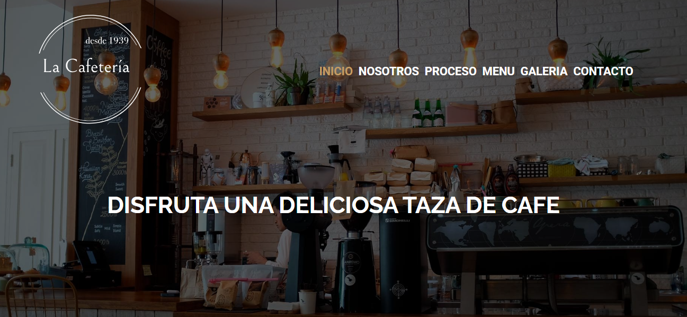
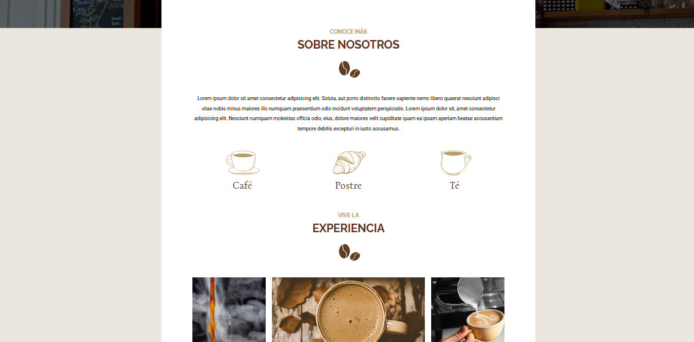
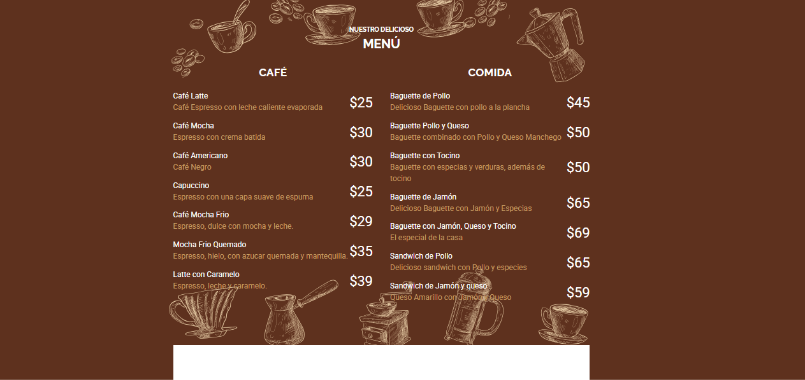
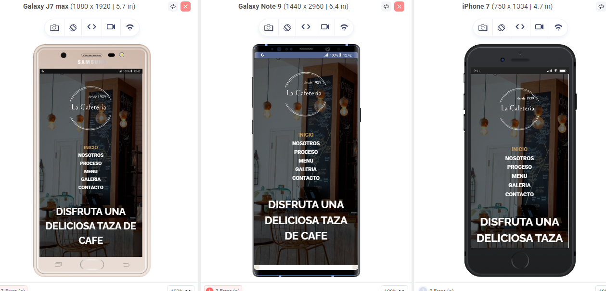
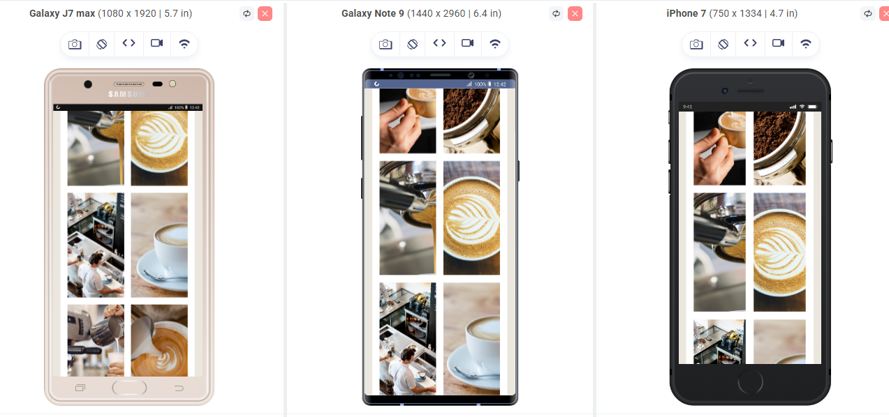
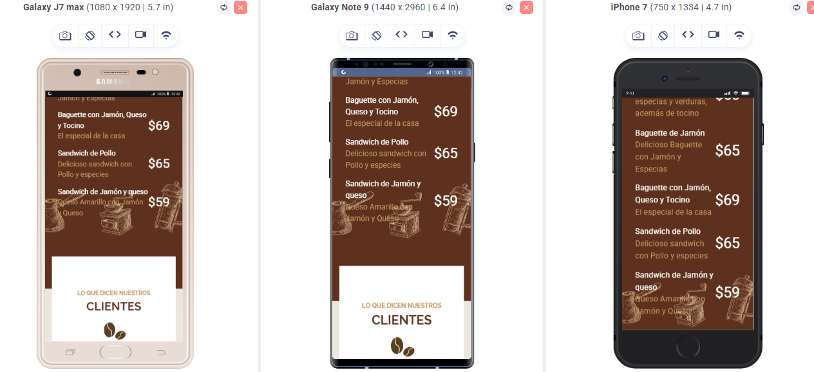

# ☕ Cafetería - Sitio Web Profesional

## 📖 Descripción

**Cafetería** es un sitio web moderno y elegante diseñado para mostrar los servicios y productos de una cafetería de alta calidad. El proyecto presenta un diseño responsivo con una interfaz de usuario intuitiva y atractiva, perfecta para atraer clientes y mostrar la experiencia gastronómica única.

##Demo
[cafeteria.app](https://cafeteria2025jebdev.netlify.app/)


##Screenshot










## ✨ Funcionalidades

### 🏠 **Páginas Principales**
- **Inicio**: Página principal con presentación de la cafetería
- **Nosotros**: Información sobre la empresa y su historia
- **Proceso**: Detalles del proceso de preparación del café
- **Menú**: Catálogo completo de productos y bebidas
- **Galería**: Colección de imágenes de la cafetería y productos
- **Contacto**: Formulario de contacto y información de ubicación

### 🎨 **Características del Diseño**
- Diseño completamente responsivo (mobile-first)
- Navegación intuitiva y accesible
- Tipografías elegantes y legibles
- Paleta de colores profesional y atractiva
- Iconografía SVG personalizada
- Galería de imágenes optimizada

### 📱 **Responsividad**
- Adaptable a todos los dispositivos móviles
- Diseño fluido para tablets y desktops
- Navegación optimizada para touch

## 🚀 Tecnologías Utilizadas

### **Frontend**
- **HTML5**: Estructura semántica y accesible
- **CSS3**: Estilos avanzados y animaciones
- **SASS/SCSS**: Preprocesador CSS con arquitectura modular
- **JavaScript**: Interactividad y funcionalidades dinámicas

### **Build Tools & Automatización**
- **Gulp**: Automatización de tareas de desarrollo
- **SASS**: Compilación de estilos SCSS a CSS
- **PostCSS**: Post-procesamiento de CSS
- **Autoprefixer**: Compatibilidad automática con navegadores
- **CSSNano**: Minificación y optimización de CSS
- **Gulp-Imagemin**: Optimización automática de imágenes
- **Gulp-WebP/AVIF**: Conversión a formatos modernos de imagen

### **Fuentes y Recursos**
- **Google Fonts**: Bona Nova, Raleway, Roboto
- **SVG**: Iconografía vectorial personalizada
- **Imágenes**: Galería optimizada y responsive

## 🛠️ Instalación y Configuración

### **Prerrequisitos**
- Node.js (versión 14 o superior)
- npm o yarn

### **Pasos de Instalación**

1. **Clonar el repositorio**
   ```bash
   git clone https://github.com/tu-usuario/cafeteria.git
   cd cafeteria
   ```

2. **Instalar dependencias**
   ```bash
   npm install
   ```

3. **Ejecutar el proyecto**
   ```bash
   # Para desarrollo (con watch)
   gulp dev
   
   # Para producción
   gulp build
   ```

### **Scripts Disponibles**
- `npm run build`: Construir proyecto para producción
- `npm run dev`: Modo desarrollo con watch automático

## 📁 Estructura del Proyecto

```
cafe/
├── src/
│   ├── scss/
│   │   ├── base/          # Estilos base y globales
│   │   ├── header/        # Estilos del encabezado
│   │   ├── footer/        # Estilos del pie de página
│   │   ├── inicio/        # Estilos de la página principal
│   │   ├── internas/      # Estilos de páginas internas
│   │   └── utilidades/    # Clases y mixins utilitarios
│   └── app.scss           # Archivo principal de estilos
├── build/                 # Archivos compilados
├── index.html             # Página principal
├── menu.html              # Página del menú
├── galeria.html           # Página de galería
├── nosotros.html          # Página sobre nosotros
├── proceso.html           # Página del proceso
├── contacto.html          # Página de contacto
└── package.json           # Dependencias y configuración
```

## 🎯 Rendimiento y Optimización

### **Optimizaciones Implementadas**
- **CSS Minificado**: Reducción del tamaño de archivos CSS
- **Imágenes Optimizadas**: Compresión automática de imágenes
- **Formatos Modernos**: Soporte para WebP y AVIF
- **Autoprefixer**: Compatibilidad automática con navegadores
- **Source Maps**: Facilita el debugging en desarrollo

### **Métricas de Rendimiento**
- Tiempo de carga optimizado
- CSS optimizado y minificado
- Imágenes responsive y comprimidas
- Navegación fluida y rápida

## 🌐 Compatibilidad de Navegadores

- **Chrome**: Última versión
- **Firefox**: Última versión
- **Safari**: Última versión
- **Edge**: Última versión
- **Navegadores móviles**: iOS Safari, Chrome Mobile

## 📱 Características Responsivas

- **Mobile First**: Diseño optimizado para dispositivos móviles
- **Breakpoints**: Adaptación fluida a diferentes tamaños de pantalla
- **Touch Friendly**: Navegación optimizada para dispositivos táctiles
- **Performance**: Carga rápida en conexiones lentas

## 🔧 Personalización

El proyecto está diseñado para ser fácilmente personalizable:

- **Variables SCSS**: Colores, tipografías y espaciados configurables
- **Mixins**: Funciones reutilizables para estilos comunes
- **Arquitectura Modular**: Fácil modificación de componentes específicos
- **Documentación**: Código comentado para facilitar modificaciones

## 👨‍💻 Autor

**JEB$DEV** - Desarrollador Web Front End

- **Especialización**: Frontend, SASS, Gulp, HTML/CSS
- **Enfoque**: Diseño web moderno y responsivo
- **Contacto**: [j.e.b.inter@gmail.com]
- **Repositorios**: [JEB$DEV](https://github.com/JEB76-22?tab=repositories)

## 📄 Licencia

Este proyecto está bajo la licencia **ISC**.

---

## 🤝 Contribuciones

Las contribuciones son bienvenidas. Por favor, abre un issue o pull request para sugerencias y mejoras.

## 📞 Soporte

Si tienes alguna pregunta o necesitas ayuda con el proyecto, no dudes en contactarme.

---

⭐ **¡No olvides dar una estrella al proyecto si te gusta!**
